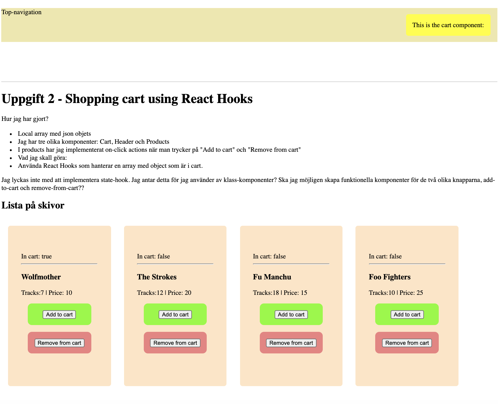

# Resultat - av Peter SALO
    <h1>Uppgift 2 - Shopping cart using React Hooks</h1>
    <p>Hur jag har gjort?</p>
    <ul>
        <li>Local array med json objets - loopar igenom array med product component</li>
        <li>Jag har tre olika komponenter: Cart, Header och Products</li>
        <li>I products har jag implementerat on-click actions när man trycker på "Add to cart" och "Remove from cart"</li>
        <li>Vad jag skall göra:</li>
        <li>Använda React Hooks som hanterar en array med object som är i cart.</li>
    </ul>
<p>Jag lyckas inte med att implementera state-hook. Jag antar detta för jag använder av klass-komponenter? Ska jag möjligen skapa funktionella komponenter för de två olika knapparna, add-to-cart och remove-from-cart??</p>

#Se bild:


# Övning

I denna övning ska du göra en React-applikationen enligt designen som du kan på bilden nedanför. Denna sida kommer i denna övning vara statisk d.v.s. du kan hårdkoda all information och knapparna etc behöver inte göra något. Vi kommer återvända till denna övning och fixa det senare.

Följande komponenter bör finnas med:
* App
* Header
* Cart (som ligger i Header)
* Product

Komponenten **Product** ska ta ett objekt som en prop och det objektet ska innehålla:
* Boktitel
* Författare
* Kort text om boken (kan vara Lorem Ipsum)

**Skiss**


# Instruktioner för utvecklingsmiljön

Detta kräver att du har installerat **node** och **npm**. Du kan ladda ner det [här](https://nodejs.org/en/).

I terminalen kör:
```
npm install
````

Efter det kör:

```
npm run serve
````

Det kommer köra igång en utvecklingserver som kollar efter förändringar du kör i dina HTML, CSS och JS filer. Vi kommer diskutera detta lite längre fram men nu fokuserar vi enbart på koden till och börja med.
